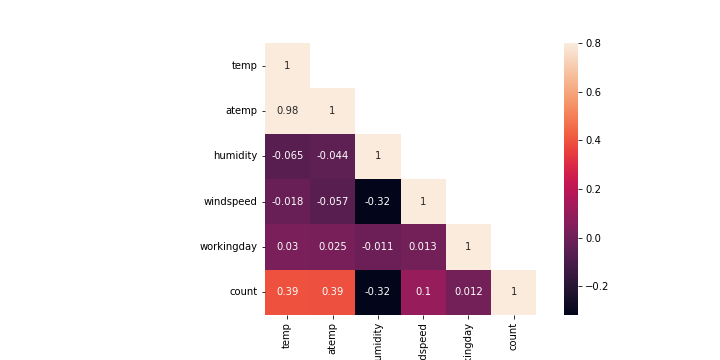

# Report: Predict Bike Sharing Demand with AutoGluon Solution
#### Steven Silvestre

## Initial Training
### What did you realize when you tried to submit your predictions? What changes were needed to the output of the predictor to submit your results?
When predicting how many bikes are rented, it doesn't make sense to end up with negative numbers. The smallest amount you can rent out is zero. So, if your prediction says you're renting out a negative number of things, that's a problem because it's not possible in real life. That's why we are replacing negative values with zero in our predictions.

### What was the top ranked model that performed?
Utilizing AutoGluon's leaderboard() functions, the WeightedEnsemble_L3 model emerged as the top performer in the AutoGluon training, achieving the highest score of -52.796196.

## Exploratory data analysis and feature creation
### What did the exploratory analysis find and how did you add additional features?

From the heatmap analysis, we see that certain factors are more closely related to the number of bicycles being rented. For instance, temperature and wind speed seem to have a significant impact. When the temperature goes up, the number of rented bicycles tends to increase as well, showing a correlation of 0.39. The same goes for wind speed, but its effect is smaller, with a correlation of 0.1.

On the other hand, humidity has the opposite effect. Higher humidity levels seem to correlate with fewer bicycle rentals, with a correlation of -0.32, indicating a significant inverse relationship.

In summary, this analysis tells us that temperature, wind speed, and humidity are important factors that should be considered when predicting bicycle rental numbers. 

Now that we've got these findings, let's dig a bit deeper into some of these variables to get a clearer picture.

As the temperature increases, the bike rental counts also tend to increase. Such a trend is reasonable and aligns with intuitive expectations – in warmer weather conditions, outdoor activities like bicycling become more appealing, leading to an increase in bike rentals.

Bike rentals decrease as humidity increases – this is also a logical and expected pattern. High humidity often makes outdoor activities less comfortable, which can lead to a decrease in the number of bicycles rented.

Based on what we've learned from the data, we're going to add some new features (or categories) to help us understand it better. These are:

**Temperature Categories:** We'll group temperatures into different buckets like 'cold', 'mild', and 'hot'. This way, we can easily see how bike rentals change with different kinds of weather. For example, do more people rent bikes when it's hot?

**Wind Speed Categories:** We'll also categorize how windy it is. Maybe categories like 'calm', 'breezy', and 'windy' can help us figure out if people prefer biking on less windy days.

**Humidity Categories:** Since we noticed that humidity affects bike rentals, we'll create groups like 'low humidity', 'moderate humidity', and 'high humidity'. This can show us if people avoid renting bikes when it's too humid.

By doing this, we make our data simpler to look at and can understand better how different weather conditions affect bike rentals. This can help us plan better for things like how many bikes we need ready on different days, or when we might need more staff around.

### How much better did your model preform after adding additional features and why do you think that is?
After adding the additional features, the model's performance improved significantly. The top model, WeightedEnsemble_L3, achieved a score of -30.347579, compared to -52.796196 previously. 
This improvement can be attributed to several factors:
- These features likely helped capture more complex patterns in the data.
- The additional features would have provided the model with more relevant variables to learn from.

## Hyper parameter tuning
### How much better did your model preform after trying different hyper parameters?
Post hyperparameter tuning, the WeightedEnsemble_L3 model's score improved to -30.347579 from -52.796196. 

This improvement can be attributed to several factors related to hyperparameter tuning:

- By tuning hyperparameters, you can find more optimal settings that lead to better model performance.
- Tuning hyperparameters can prevent models from becoming too complex and overfitting the training data.

Each hyperparameter adjustment played a specific role in model enhancement. For instance:

- Reducing the **learning_rate** made the model training more gradual and precise.
- Increasing **num_boost_round** allowed the model to learn more from the data.
- Adjusting **num_leaves** and **min_data_in_leaf** helped in better capturing data complexities while avoiding overfitting.

These changes collectively enhanced the model's ability to generalize better to unseen data.

### If you were given more time with this dataset, where do you think you would spend more time?
Given more time, I'd focus primarily on enhancing the features. This involves exploring deeper connections in the data and creating new ones. Particularly for a rental dataset, analyzing time-based patterns, like changes in rental trends over different seasons or past behaviors, would be a key area of focus.

### Create a table with the models you ran, the hyperparameters modified, and the kaggle score.
|model|learning_rate|num_boost_round|num_leaves|min_data_in_leaf|score|
|--|--|--|--|--|--|
|initial|default|default|default|default|1.78837|
|add_features|Default|Default|Default|default|0.6928|
|hpo|0.05|300|30|20|0.52244|
|hpo1|0.021|370|42|25|0.5122|

### Create a line plot showing the top model score for the three (or more) training runs during the project.

Initially, the score was -52.83, which improved to -30.245 with new variables, and then to -32.74 with hyperparameter tuning. The slight deterioration in the score after hyperparameter tuning suggests possible overfitting.

### Create a line plot showing the top kaggle score for the three (or more) prediction submissions during the project.

The model's Kaggle score improved from 1.79937 to 0.69288 with additional features and further to 0.52244 and 0.5122 with hyperparameter optimization, indicating the effectiveness of these enhancements.

## Summary

