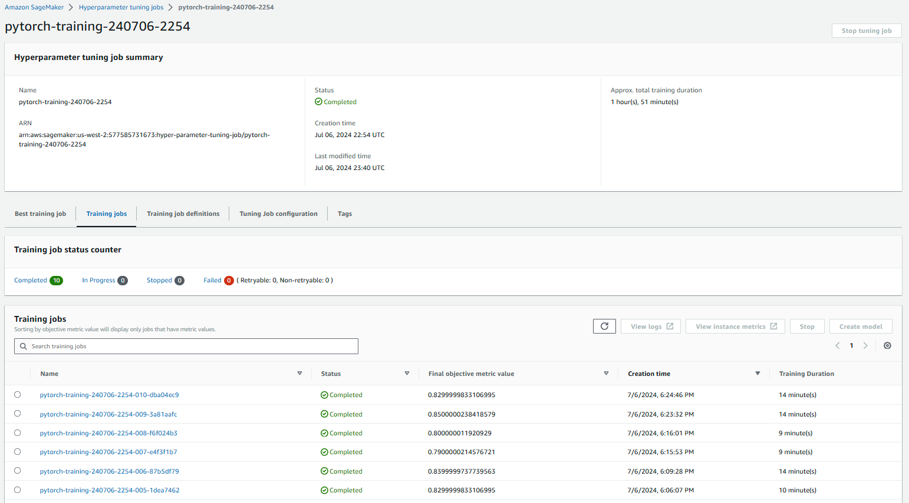
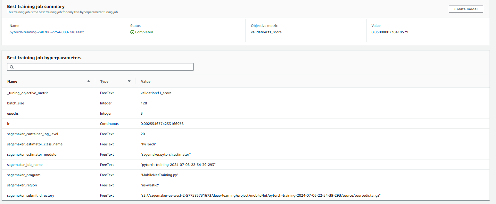
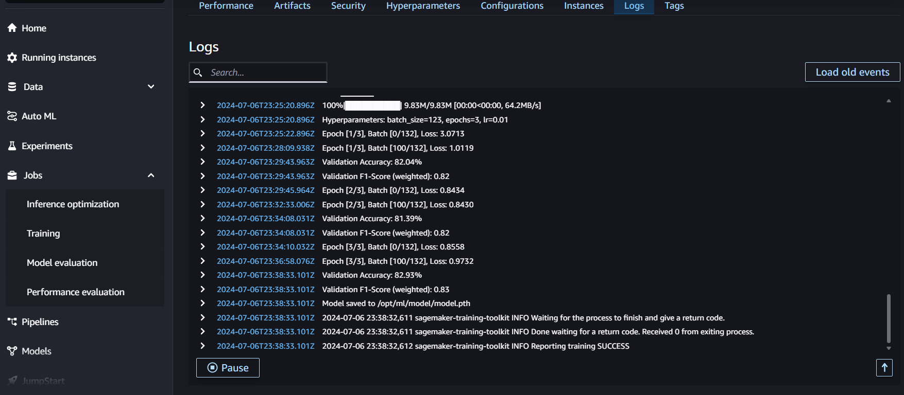
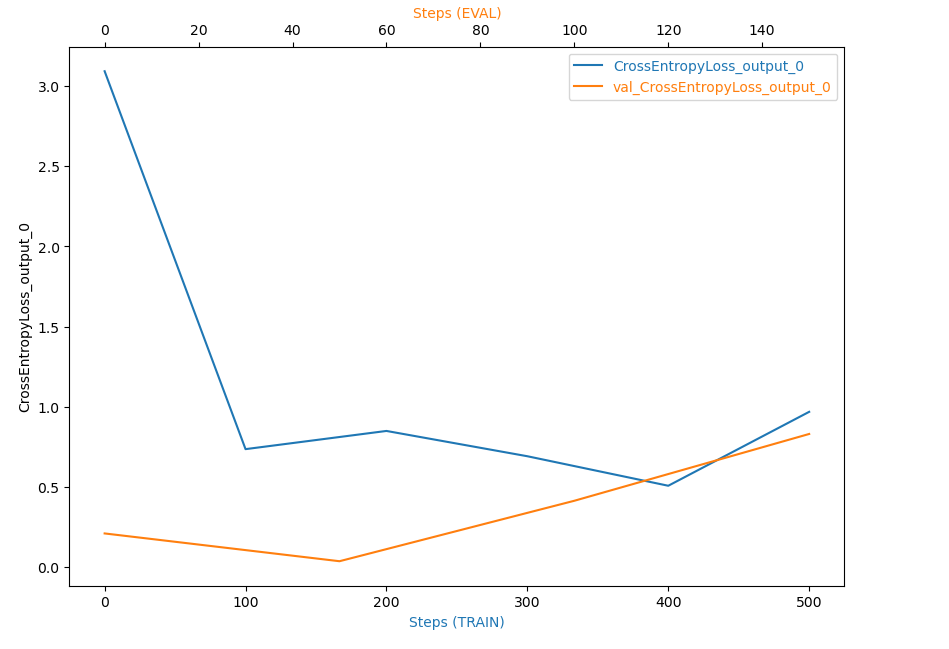
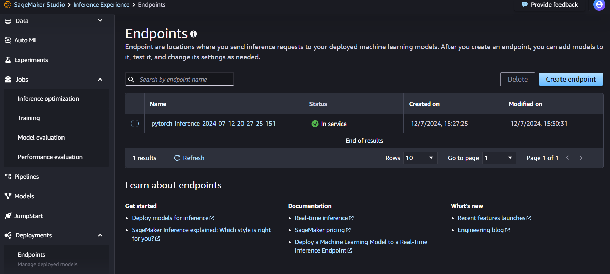

# Image Classification using AWS Sagemaker

This README file provides an overview and instructions for the project using Sagemaker.

## Project Overview

This project focuses on classifying different categories of clothing using AWS SageMaker. It demonstrates the process of building, training, and deploying an image classification model. The project involves uploading training data to S3, training a pre-trained model with hyperparameter tuning, and deploying the model to a SageMaker endpoint for inference.

## Project Setup Instructions

1. **Clone the Repository**:
    Use the AWS SageMaker "Clone a Git Repository" option to clone the repository directly into your SageMaker environment.

2. **Download the Data**:
    Download the dataset from the following link: [Polyvore Dataset](https://github.com/xthan/polyvore-dataset)

3. **Upload Data to S3**:
    Upload the data to S3.

4. **Open Jupyter Notebook**:
    In the SageMaker Jupyter environment, open the provided Jupyter notebook for the project and follow the steps.

## Files in the Project

1. fetch_and_prepare_training_data.ipynb:Notebook for fetching and preparing the training data. This includes downloading the dataset, performing any necessary preprocessing, and organizing the data for model training.
2. tuning&deploy_mobilenet.ipynb: Notebook for tuning and deploying the MobileNet model. This involves hyperparameter tuning, model optimization, and steps to deploy the model for inference. Additionally, it includes debugging and profiling using TVM to enhance performance and efficiency.
3. MobileNetTraining.py: Python script used exclusively for hyperparameter tuning of the MobileNet model. This script includes functions for data extraction, transformations, and model training, but does not contain model persistence, debugging, or profiling blocks.
4. MobileNetTrainingDebugProfile.py: Python script for debugging and profiling the MobileNet model training process. This script helps identify performance bottlenecks and optimize the training procedure. It is used to train the model with the best hyperparameters found, as well as for debugging and profiling.
5. inference.py: Python script for performing inference using the trained MobileNet model. T
6. img/: Directory containing images related to the project. This may include sample images from the dataset, visualizations of the model's performance, or other relevant graphics.

## Model Selection: MobileNet

We are using MobileNet as our pre-trained model for this project. MobileNet is a lightweight, efficient model that is well-suited for mobile and embedded vision applications. Its architecture is designed to reduce the number of parameters and computational cost, making it ideal for scenarios with limited resources.

## Hyperparameter Optimization

In this section, we fine-tune the MobileNet model and optimize its hyperparameters to improve performance.

1. **Define Hyperparameter Ranges**:
    
2. **Initialize the Hyperparameter Tuner**:
    
3. **Start Hyperparameter Tuning**:

### Visualize Tuning Progress

Monitor the progress of the hyperparameter tuning jobs through the SageMaker console.

We can observe the various training runs conducted during the hyperparameter tuning process.

Status: The job has been marked as "Completed," indicating that the training process finished without any critical issues or interruptions.

Objective Metric: The key metric for evaluating the model's performance was the F1-score on the validation set.

Validation F1-Score: The model achieved a validation F1-score of 0.85. This score suggests that the model has a good balance between precision and recall, indicating effective performance in classifying the dataset.

## Training Model with Best Hyperparameters and Debugging

In this section, we describe how to train the MobileNet model with the best hyperparameters found during hyperparameter tuning. Additionally, we provide guidelines for monitoring and debugging the training process.

### Training with Best Hyperparameters

After completing the hyperparameter tuning job, use the best hyperparameters to train the model. This ensures the model is trained with the most optimal settings for performance.

### Monitoring and Debugging

It's important to monitor the training process and be prepared to debug any issues that arise. Below is an example plot showing the CrossEntropyLoss over training steps for both training and validation datasets, which helps in identifying potential issues.

### Interpreting the Debugging Plot

The plot above shows the training and validation loss throughout the training process. 

1. **Normal Behavior**:
    - The training loss (blue line) should generally decrease over time.
    - The validation loss (orange line) should also decrease, ideally following a similar trend to the training loss.

2. **Anomalous Behavior**:
    - **Spikes or Plateaus**: Sudden spikes or plateaus in the loss curves can indicate issues.
    - **Divergence**: A large divergence between training and validation loss might suggest overfitting or data issues.

### Debugging Steps

If you observe any anomalous behavior in the plot, follow these steps to debug the model:

1. **Identify the Anomaly**:
    - Determine the point at which the anomaly occurs in the training process.

2. **Check Data Pipeline**:
    - Verify that the data is being loaded and preprocessed correctly. Ensure data augmentation and normalization steps are applied consistently.

3. **Review Hyperparameters**:
    - Examine the chosen hyperparameters to ensure they are within reasonable ranges.

4. **Analyze Model Architecture**:
    - Confirm that the MobileNet architecture is correctly implemented without any issues.

5. **Monitor Training Logs**:
    - Use AWS CloudWatch logs to review detailed logs of the training process. Look for warnings or errors.

6. **Conduct Experiments**:
    - Try different combinations of hyperparameters to see if the issue persists. 

## Model Deployment

Once the model is trained and optimized, the next step is to deploy it to a SageMaker endpoint.

### Visualization of Image Inferences

The following plot displays images along with their actual and predicted categories. Each image is displayed with a title indicating the actual category and the predicted label. The title color is green if the prediction is correct and red if it is incorrect.

## Conclusion

This project provides a comprehensive guide to building, training, and deploying an image classification model using AWS SageMaker. The steps include data preparation, hyperparameter tuning, model profiling, deployment, and inference visualization, ensuring optimal performance and reliability of your model.
