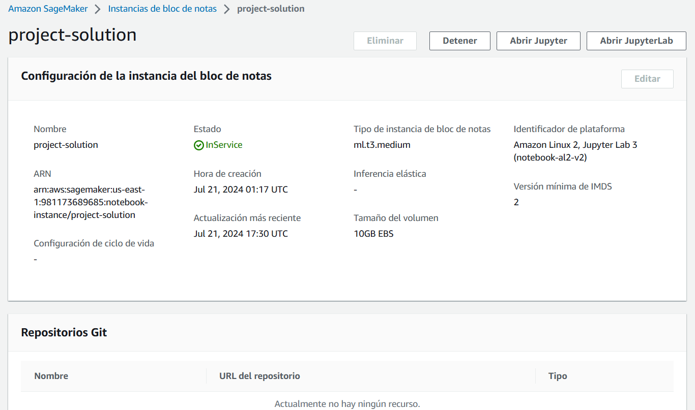
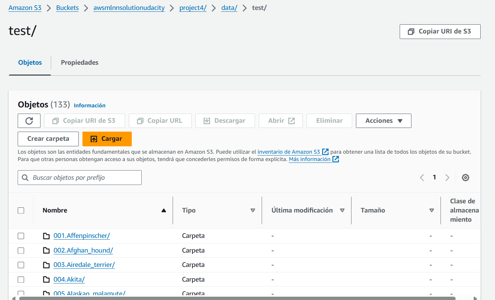
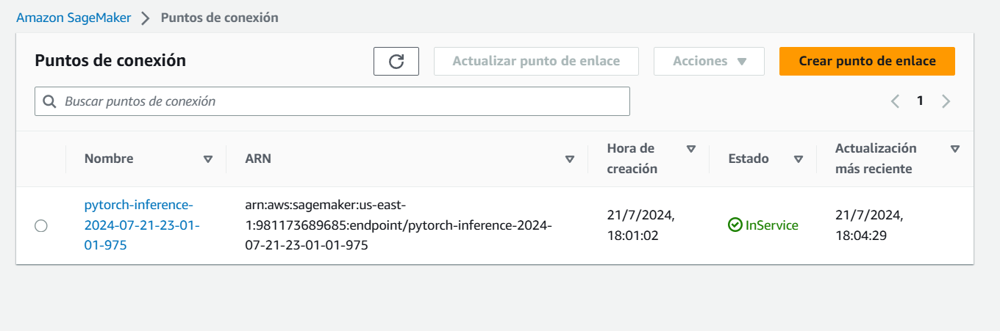
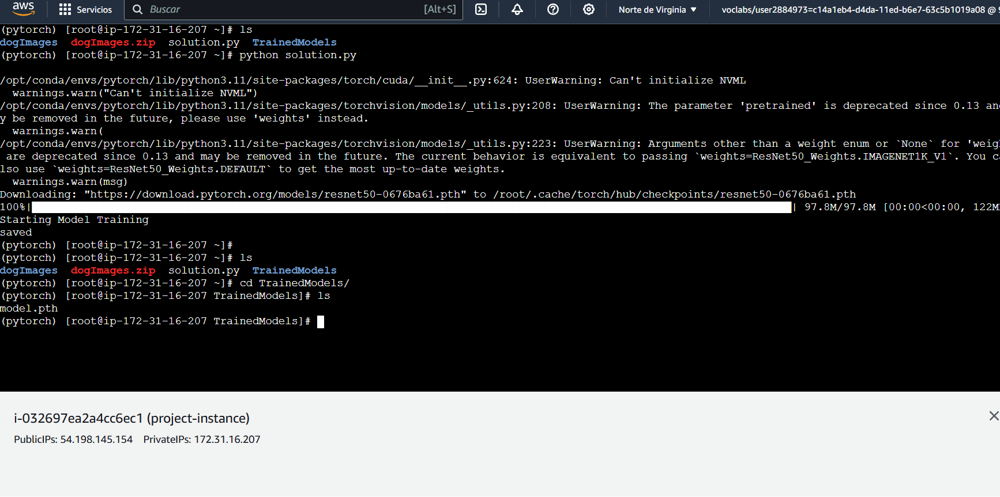
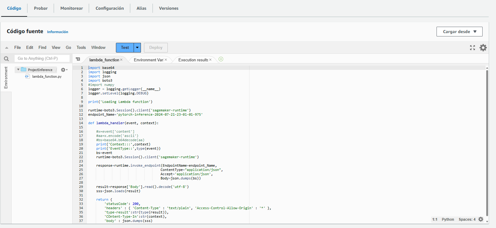
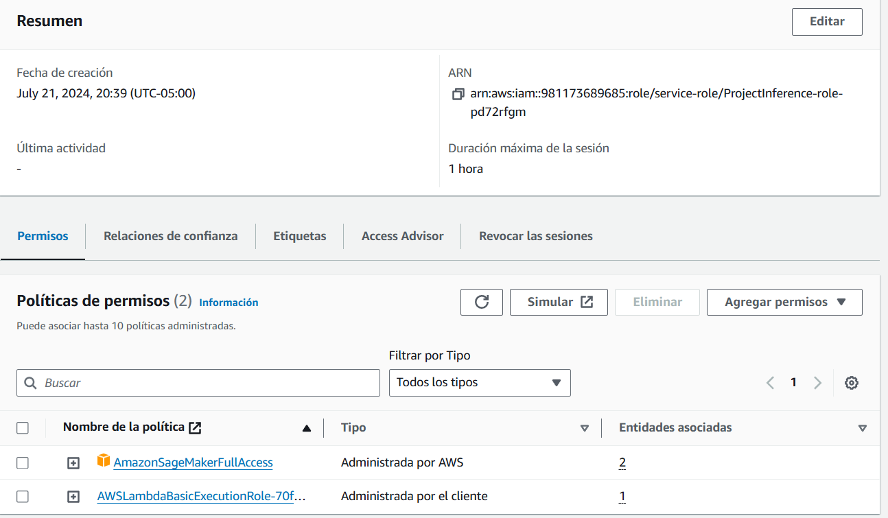
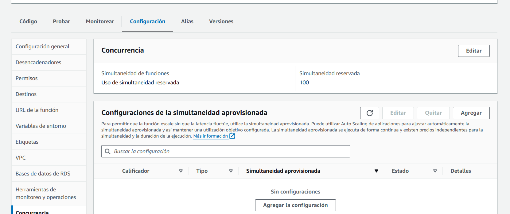
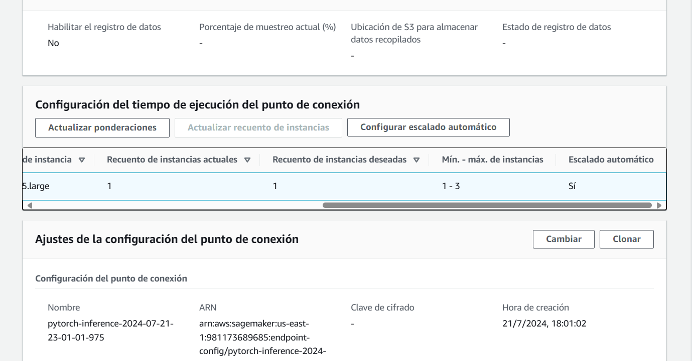

# Operationalizing an AWS ML Project

## Introduction

This project involves setting up, training, and deploying a machine learning model using AWS services such as SageMaker, EC2, and Lambda. The following sections describe each step in detail, including justifications and screenshots.

## Sagemaker Instance Setup

### Justification
We chose the `ml.t3.medium` instance due to its cost-efficiency and sufficient capabilities for our current tasks, which do not require high computational power. This instance is ideal for development and initial testing phases. For more resource-intensive tasks such as model training and endpoint deployment, we will utilize more powerful instances to ensure optimal performance.

## S3 Bucket and Download Data

## Endpoint Deployment

## Model Training on EC2

### Justification
We selected a `t2.xlarge` EC2 instance for training the model. This instance type provides a balanced combination of computational power and memory at a reasonable cost, making it suitable for training machine learning models without incurring high expenses.

The `t2.xlarge` instance offers the following specifications:
- **4 vCPUs:** Provides sufficient parallel processing power for handling the training workload.
- **16 GB RAM:** Ensures adequate memory for loading large datasets and performing complex computations.

## Lambda function setup

## Security and testing

### SagemakerFullAccess
The `SagemakerFullAccess` policy is attached to the Lambda function to ensure it has the necessary permissions to invoke the SageMaker endpoint.

### Lambda Response

{
  "statusCode": 200,
  "headers": {
    "Content-Type": "text/plain",
    "Access-Control-Allow-Origin": "*"
  },
  "type-result": "<class 'str'>",
  "COntent-Type-In": "LambdaContext([aws_request_id=29966269-4ee3-4608-89ae-20f56e95a981,log_group_name=/aws/lambda/ProjectInference,log_stream_name=2024/07/22/[$LATEST]739400355d4e4a7399107b89615ecb47,function_name=ProjectInference,memory_limit_in_mb=128,function_version=$LATEST,invoked_function_arn=arn:aws:lambda:us-east-1:981173689685:function:ProjectInference,client_context=None,identity=CognitoIdentity([cognito_identity_id=None,cognito_identity_pool_id=None])])",
  "body": "[[-2.6200966835021973, -1.7839187383651733, -0.4178096652030945, -0.10426720976829529, -1.8988728523254395, -0.933385968208313, 0.11574618518352509, 0.2227245569229126, -2.6947293281555176, -0.9397773742675781, -0.07906225323677063, -2.775785207748413, -1.8236974477767944, 0.16907787322998047, -0.30387765169143677, 0.22626635432243347, -2.5950417518615723, -1.090857982635498, -0.2849547266960144, 0.37625932693481445, -3.3860466480255127, -3.8015332221984863, -2.0609374046325684, -0.34431833028793335, -0.7686353921890259, -2.340825319290161, -1.4663516283035278, -1.2728859186172485, -2.6480000019073486, -1.4626139402389526, -0.24683457612991333, 0.49775874614715576, -2.9164586067199707, 0.5274293422698975, -2.2854857444763184, -2.252896785736084, -0.2293662428855896, -2.7789041996002197, 0.3206307291984558, 0.31204500794410706, 0.5477383732795715, -1.0781968832015991, 0.10801893472671509, -0.22434665262699127, -0.3700046241283417, -2.5641989707946777, -0.49638745188713074, 0.19743612408638, -0.23933890461921692, -0.3034432530403137, -3.316411256790161, -2.578518867492676, -1.534406065940857, -3.342711925506592, -1.3900455236434937, 0.3976074159145355, 0.5164934396743774, -2.619682550430298, -0.07329715043306351, 0.1945071518421173, -2.0222928524017334, -1.9498764276504517, -1.9161618947982788, -3.057030200958252, -1.7671260833740234, -2.8360300064086914, -2.3107025623321533, -2.809753894805908, 0.20653001964092255, 0.12632763385772705, -0.7888611555099487, -0.26157423853874207, -3.153384208679199, -0.9414727091789246, -0.854934573173523, -2.436195135116577, -2.3062353134155273, 0.045636892318725586, -3.17529559135437, -0.9643175601959229, -0.12698867917060852, -2.047363519668579, -0.3911607265472412, -1.5308877229690552, -3.701103448867798, -2.9475865364074707, -0.23599863052368164, -1.563971996307373, -0.9192569255828857, 0.025611579418182373, -2.7792139053344727, -2.424269914627075, -0.5820273160934448, -2.2383387088775635, -1.3870028257369995, -0.31287312507629395, -0.41768208146095276, -3.591280937194824, -3.357588768005371, -2.636568069458008, -2.049746036529541, -0.4494418501853943, -1.5631604194641113, -1.3981214761734009, -2.943140745162964, -1.6067579984664917, -2.276179075241089, -1.133593201637268, -1.4700597524642944, -0.7914201021194458, -2.3167712688446045, -1.840497612953186, -2.7719225883483887, -3.7864551544189453, -1.0627199411392212, -0.1264093816280365, -1.5903493165969849, -0.594165563583374, -3.0885629653930664, -0.1452547311782837, -0.5102335214614868, -0.2766529619693756, -1.9208509922027588, -0.35039132833480835, -1.8070651292800903, -1.9742166996002197, -1.1161662340164185, -0.4824203550815582, -2.8923027515411377, -2.4856245517730713, -2.928375005722046, -0.655624508857727, -2.038344144821167]]"
}

### Potential Vulnerabilities

In the IAM setup, we identified several potential vulnerabilities that could compromise the security of our AWS environment. These vulnerabilities include:

1. **Roles with "FullAccess" Policies Attached:**
   - Roles with "FullAccess" policies can perform any action on all resources. This broad level of access increases the risk of accidental or malicious actions that could affect the entire AWS account. We need to review and minimize the use of such policies, ensuring that roles only have the permissions necessary for their specific tasks.

2. **Old or Inactive Roles:**
   - Roles that have not been used for an extended period or are no longer required pose a security risk. These roles might still have active permissions, making them potential targets for exploitation.

3. **Roles with Policies for Functions No Longer in Use:**
   - Roles that contain policies for functions no longer in use can lead to unnecessary exposure. These roles might have permissions that are not needed anymore, and retaining them can lead to potential security gaps. 

## Concurrency and Auto-Scaling Configuration

### Concurrency

We have configured a reserved concurrency of 100 for our Lambda function. This means that up to 100 instances of the function can run simultaneously, ensuring that we can handle a moderate level of traffic without delays. By setting this limit, we can control costs.

#### Consideration for Production Environments
In a production environment, it might be necessary to implement provisioned concurrency for the Lambda function. Provisioned concurrency keeps the specified number of instances warm and ready to handle requests immediately, thus avoiding the latency that can occur during the initial cold start. 

### Auto-Scaling

The SageMaker endpoint is set up with auto-scaling enabled, with a maximum limit of 3 instances. This configuration allows the endpoint to scale up or down based on the incoming request load.

## Conclusion

This project demonstrates the complete lifecycle of deploying a machine learning model using AWS services, from data preparation and model training to deployment and endpoint invocation. The steps outlined ensure a scalable, secure, and efficient solution.

