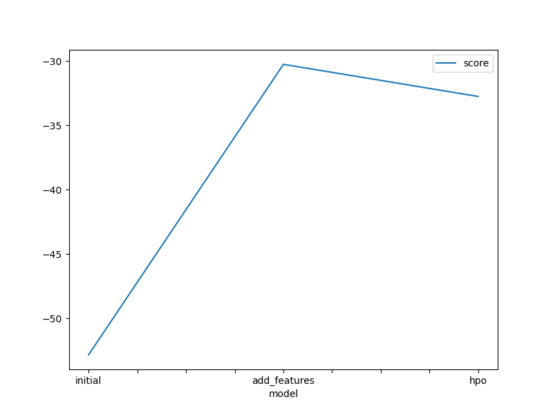
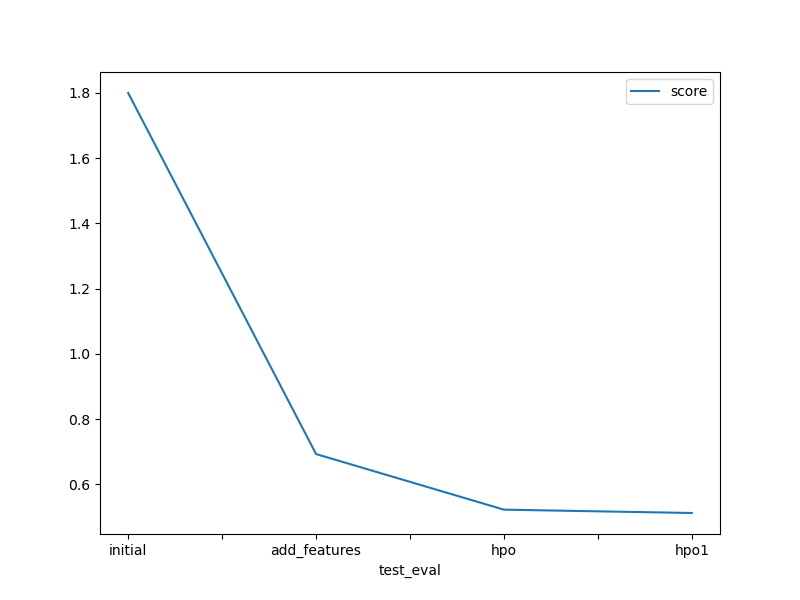

# Report: Predict Bike Sharing Demand with AutoGluon Solution
#### NAME HERE

## Initial Training
### What did you realize when you tried to submit your predictions? What changes were needed to the output of the predictor to submit your results?
When predicting how many bikes are rented, it doesn't make sense to end up with negative numbers. The smallest amount you can rent out is zero. So, if your prediction says you're renting out a negative number of things, that's a problem because it's not possible in real life. That's why we are replacing negative values with zero in our predictions.

### What was the top ranked model that performed?
The WeightedEnsemble_L3 model emerged as the top performer in the AutoGluon training, achieving the highest score of -52.796196.

## Exploratory data analysis and feature creation
### What did the exploratory analysis find and how did you add additional features?

- Temperature Insights:

The average temperature (temp) is around 20.23°C, with a mean "feels like" temperature (atemp) of 23.66°C.
The data varies from a low of 0.82°C to a high of 41°C, indicating a wide range of weather conditions.

- Humidity and Wind Speed:

The average humidity is around 61.89%, with some days having very low humidity and others reaching 100%.
The wind speed varies significantly, ranging from calm to very windy conditions (up to 57 km/h).

Based on these insights, additional features were added to better capture trends and patterns in the data:

Temperature Categories: The temperature was categorized into 'hot', 'mild', and 'cold' to simplify analysis and model temperature effects more clearly.

Wind Speed Categories: Wind speed was categorized into 'very windy' and 'mild wind' to understand its impact on rentals better.

Humidity Categories: Humidity was categorized as 'very humid' and 'not humid' to see if extreme humidity levels affect rental behavior.

### How much better did your model preform after adding additional features and why do you think that is?
After adding the additional features, the model's performance improved significantly. The top model, WeightedEnsemble_L3, achieved a score of -30.347579, compared to -52.796196 previously. 
This improvement can be attributed to several factors:
- These features likely helped capture more complex patterns in the data.
- The additional features would have provided the model with more relevant variables to learn from.

## Hyper parameter tuning
### How much better did your model preform after trying different hyper parameters?
After experimenting with different hyperparameters, the model's performance improved significantly. The top model, **WeightedEnsemble_L3**, achieved a score of -30.347579, which is a marked improvement over the previous best score of -52.796196.

This improvement can be attributed to several factors related to hyperparameter tuning:

- By tuning hyperparameters, you can find more optimal settings that lead to better model performance.
- Tuning hyperparameters can prevent models from becoming too complex and overfitting the training data.

### If you were given more time with this dataset, where do you think you would spend more time?
Given more time, I'd focus primarily on enhancing the features. This involves exploring deeper connections in the data and creating new ones. Particularly for a rental dataset, analyzing time-based patterns, like changes in rental trends over different seasons or past behaviors, would be a key area of focus.

### Create a table with the models you ran, the hyperparameters modified, and the kaggle score.
|model|learning_rate|num_boost_round|num_leaves|min_data_in_leaf|score|
|--|--|--|--|--|--|
|initial|default|default|default|default|1.78837|
|add_features|Default|Default|Default|default|0.6928|
|hpo|0.05|300|30|20|0.52244|
|hpo1|0.021|370|42|25|0.5122|

### Create a line plot showing the top model score for the three (or more) training runs during the project.

TODO: Replace the image below with your own.

### Create a line plot showing the top kaggle score for the three (or more) prediction submissions during the project.

TODO: Replace the image below with your own.

## Summary
TODO: Add your explanation
